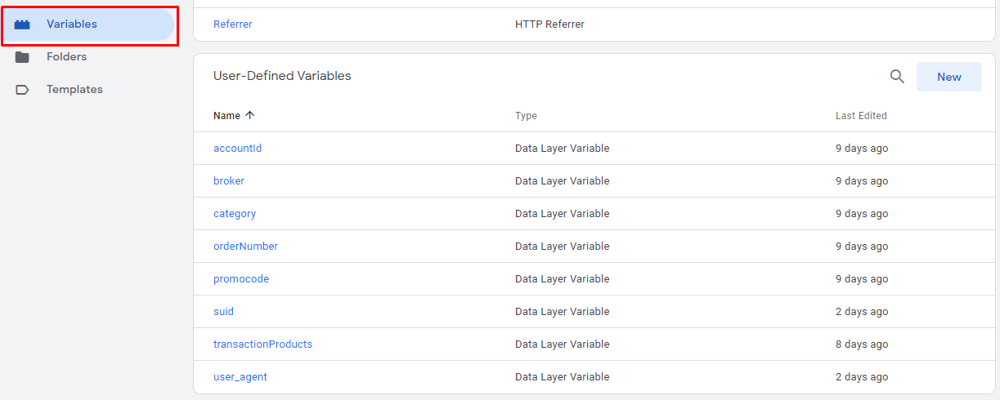

# Admitad Journey template

Admitad Journey template **should fire on every page** of your site.

Configure your tracking template in accordance with your dataLayer variables.    
Fill in all mandatory fields, otherwise, the high quality of tracking `is not guaranteed`.

See below an example for Google Tag Manager variables and a template configured for dataLayer.

## dataLayer code

Example of the dataLayer code (real code on your site may differ):  

```javascript
// SHA-256 hash of the current user's email 'test@email.com'
// we strongly recommend using the standard SHA hashing
let hashed_customer_id = '73062D872926C2A556F17B36F50E328DDF9BFF9D403939BD14B6C3B7F5A33FC2';
window.dataLayer = window.dataLayer || [];
dataLayer.push({
  'transactionCustomer': hashed_customer_id,
  'suid': ([1e7] + -1e3 + -4e3 + -8e3 + -1e11).replace(/[018]/g, function(c) {return (c ^ (window.crypto || window.msCrypto).getRandomValues(new Uint8Array(1))[0] & 15 >> c / 4).toString(16)})
});
```

Code annotations:
* `suid` — [UUID4 identifier](https://tools.ietf.org/html/rfc4122)  
* `hashed_customer_id` — a hashed ID of a user in your system (email, login, etc.). We `strongly recommend` using the standard SHA hashing

## Google Tag Manager variables

You can configure the dataLayer variables in the Variables menu.




Mapping of dataLayer keys and GTM variables:

```md
'transactionCustomer' -> {{accountId}}
'suid' -> {{suid}}
```

## Template configuration

Please note that the real value of your `campaign_code` will be sent during integration.  
See an example of the configured template below.
  

