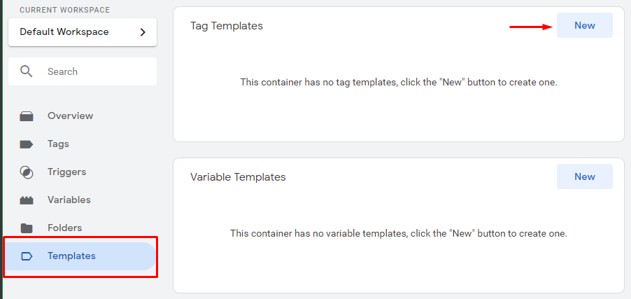
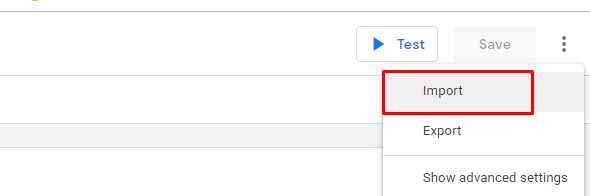
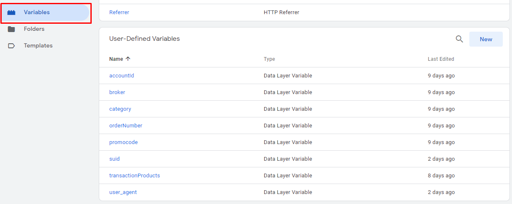
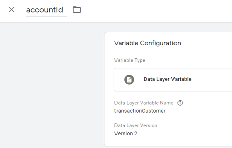
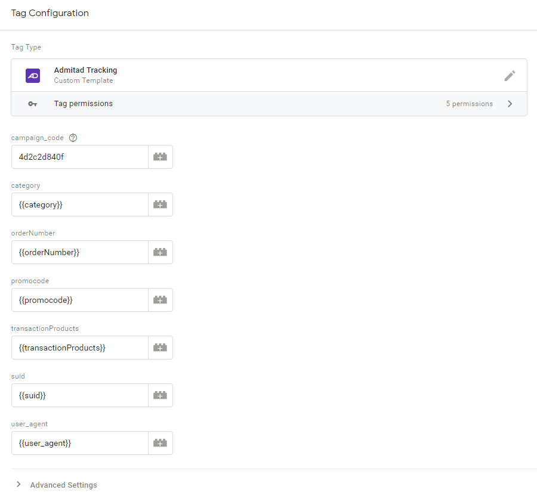

# Admitad Tracking Template for Google Tag Manager

## Table of contents

* [Overview](#overview)
* [Contents](#contents)
* [Installation](#installation)
* [Configuration](#configuration)
* [License](#license)

## <a id="overview"></a>Overview

Admitad Template for Google Tag Manager provides easy-driven integration with [Admitad](https://www.admitad.com/en/).  
This template tracks users’ actions on your website and sends the data to the Admitad statistics.  
When the template fires, the Admitad server receives a request with the information on this action (order ID, order amount, etc.).

For more on the Admitad tracking code, see [here](https://help.admitad.com/en/advertiser/topic/227-installing-admitad-tracking-code-in-google-tag-manager#purpose).

## <a id="contents"></a>Contents

Admitad Template for Google Tag Manager consists of two mandatory parts:
* [Journey template](https://github.com/AdmitadSDK/Admitad-GTM-Journey-Template)
* [Tracking template](https://github.com/AdmitadSDK/Admitad-GTM-Tracking-Template)

Both templates should be [installed](#installation) and configured as described in the corresponding manual.  
Otherwise, the high quality of tracking `is not guaranteed`. 

## <a id="installation"></a>Installation

1. Download the `template.tpl` file
2. Create a new tag template in the Templates menu

    

3. Import the `template.tpl` file

    
    

## <a id="configuration"></a>Configuration

Admitad Tracking template **should fire on a thank you page** of your site.

Configure your tracking template in accordance with your dataLayer variables.   
Fill in all mandatory fields, otherwise, the high quality of tracking `is not guaranteed`.

See below an example for Google Tag Manager variables and a template configured for dataLayer.

### dataLayer code

Example of the dataLayer code (real code on your site may differ):

```javascript
let transactionProducts = [];
let order_number = '#1';
let promocode = 'my_promo'; 
// SHA-256 hash of the current user's email 'test@email.com'
// we strongly recommend using the standard SHA hashing
let hashed_customer_id = '73062D872926C2A556F17B36F50E328DDF9BFF9D403939BD14B6C3B7F5A33FC2';

// fill array of purchased items
let cart = [];
cart.push({
    'product_id': '123',
    'price': 5.15,
    'currency': 'EUR',
    'quantity': 2
});

cart.forEach((item) => {
	transactionProducts.push({
	    'sku': item.product_id,
		'tariff': '1', // Admitad rate code
		'price': item.price,
		'priceCurrency': item.currency,
		'quantity': item.quantity 
	});
});

window.dataLayer = window.dataLayer || [];
dataLayer.push({       
	'transactionId': order_number,
	'transactionAction': '1', // Admitad action code
	'transactionPromocode': promocode,
	'transactionProducts': transactionProducts,
	'suid': ([1e7] + -1e3 + -4e3 + -8e3 + -1e11).replace(/[018]/g, function(c) {return (c ^ (window.crypto || window.msCrypto).getRandomValues(new Uint8Array(1))[0] & 15 >> c / 4).toString(16)}),
	'user_agent': navigator.userAgent
});
```

Code annotations:
* `suid` — [UUID4 identifier](https://tools.ietf.org/html/rfc4122)  
* `hashed_customer_id` — a hashed ID of a user in your system (email, login, etc.). We `strongly recommend` using the standard SHA hashing
* `user_agent` — the [User-Agent](https://developer.mozilla.org/en-US/docs/Web/HTTP/Headers/User-Agent) from the browser global

### Google Tag Manager variables

You can configure the dataLayer variables in the Variables menu.





Mapping of dataLayer keys and GTM variables:

```md
'transactionAction' -> {{category}}
'transactionId' -> {{orderNumber}}
'promocode' -> {{promocode}}
'transactionProducts' -> {{transactionProducts}}
'suid' -> {{suid}}
'user_agent' -> {{user_agent}}
```

### Template configuration

Please note that the real value of your `campaign_code` will be sent during integration.  
See an example of the configured template below.




## <a id="license"></a>License

The Admitad Tracking template is licensed under the MIT License.

Copyright (c) 2019 Admitad GmbH

Permission is hereby granted, free of charge, to any person obtaining a copy of this software and associated documentation files (the "Software"), to deal in the Software without restriction, including without limitation the rights to use, copy, modify, merge, publish, distribute, sublicense, and/or sell copies of the Software, and to permit persons to whom the Software is furnished to do so, subject to the following conditions:

The above copyright notice and this permission notice shall be included in all copies or substantial portions of the Software.

THE SOFTWARE IS PROVIDED "AS IS", WITHOUT WARRANTY OF ANY KIND, EXPRESS OR IMPLIED, INCLUDING BUT NOT LIMITED TO THE WARRANTIES OF MERCHANTABILITY, FITNESS FOR A PARTICULAR PURPOSE AND NONINFRINGEMENT. IN NO EVENT SHALL THE AUTHORS OR COPYRIGHT HOLDERS BE LIABLE FOR ANY CLAIM, DAMAGES OR OTHER LIABILITY, WHETHER IN AN ACTION OF CONTRACT, TORT OR OTHERWISE, ARISING FROM, OUT OF OR IN CONNECTION WITH THE SOFTWARE OR THE USE OR OTHER DEALINGS IN THE SOFTWARE.
