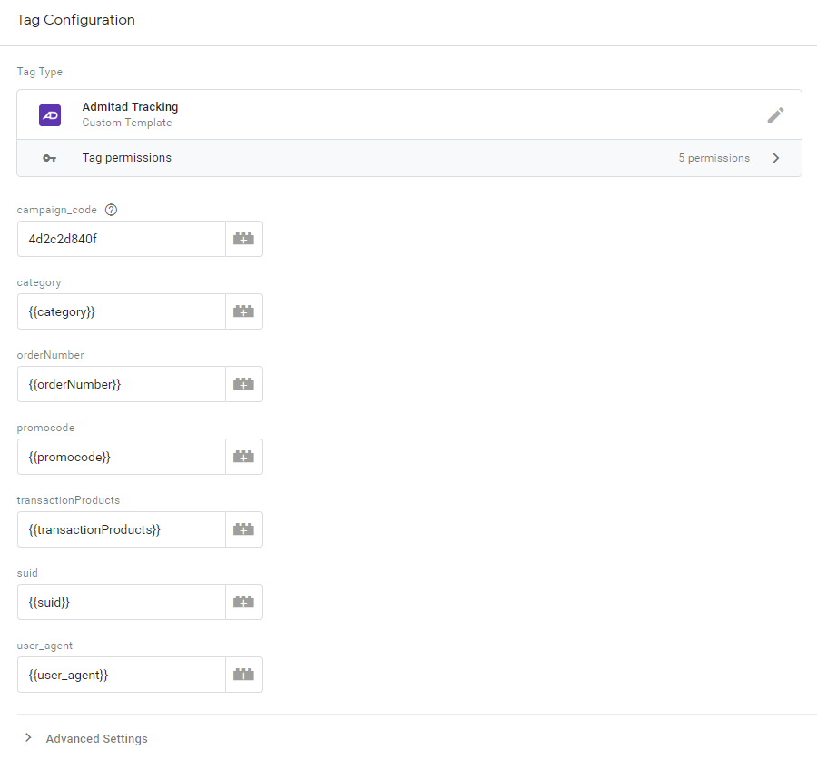

# Admitad Tracking template

Admitad Tracking template **should fire on a thank you page** of your site.

Configure your tracking template in accordance with your dataLayer variables.   
Fill in all mandatory fields, otherwise, the high quality of tracking `is not guaranteed`.

See below an example for Google Tag Manager variables and a template configured for dataLayer.

## dataLayer code

Example of the dataLayer code (real code on your site may differ):

```javascript
let transactionProducts = [];
let order_number = '#1';
let promocode = 'my_promo'; 
// SHA-256 hash of the current user's email 'test@email.com'
// we strongly recommend using the standard SHA hashing
let hashed_customer_id = '73062D872926C2A556F17B36F50E328DDF9BFF9D403939BD14B6C3B7F5A33FC2';

// fill array of purchased items
let cart = [];
cart.push({
    'product_id': '123',
    'price': 5.15,
    'currency': 'EUR',
    'quantity': 2
});

cart.forEach((item) => {
	transactionProducts.push({
	    'sku': item.product_id,
		'tariff': '1', // Admitad rate code
		'price': item.price,
		'priceCurrency': item.currency,
		'quantity': item.quantity 
	});
});

window.dataLayer = window.dataLayer || [];
dataLayer.push({       
	'transactionId': order_number,
	'transactionAction': '1', // Admitad action code
	'transactionPromocode': promocode,
	'transactionProducts': transactionProducts,
	'suid': ([1e7] + -1e3 + -4e3 + -8e3 + -1e11).replace(/[018]/g, function(c) {return (c ^ (window.crypto || window.msCrypto).getRandomValues(new Uint8Array(1))[0] & 15 >> c / 4).toString(16)}),
	'user_agent': navigator.userAgent
});
```

Code annotations:
* `suid` — [UUID4 identifier](https://tools.ietf.org/html/rfc4122)  
* `hashed_customer_id` — a hashed ID of a user in your system (email, login, etc.). We `strongly recommend` using the standard SHA hashing
* `user_agent` — the [User-Agent](https://developer.mozilla.org/en-US/docs/Web/HTTP/Headers/User-Agent) from the browser global

## Google Tag Manager variables

You can configure the dataLayer variables in the Variables menu.


Mapping of dataLayer keys and GTM variables:

```md
'transactionAction' -> {{category}}
'transactionId' -> {{orderNumber}}
'promocode' -> {{promocode}}
'transactionProducts' -> {{transactionProducts}}
'suid' -> {{suid}}
'user_agent' -> {{user_agent}}
```

## Template configuration

Please note that the real value of your `campaign_code` will be sent during integration.  
See an example of the configured template below.


